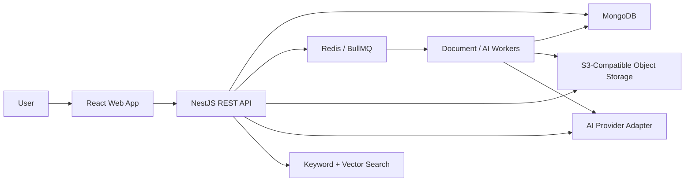

# System Architecture

## Context

## Main Modules

- Auth: registration, login, logout, reset, verification, sessions.
- Organizations: tenancy, members, roles, invitations, settings.
- Projects: status, members, objectives, documents, decisions, activity.
- Knowledge: structured content items and source metadata.
- Documents: upload, validation, extraction, chunking, summaries.
- AI: provider abstraction, retrieval, citations, token tracking.
- Search: keyword, metadata, semantic, tenant and permission filters.
- Activity: timeline and audit trail.
- Integrations: provider catalog, connection model, sync jobs.

## Backend Architecture

NestJS modules expose REST controllers, DTO validation, service classes, repositories, and background jobs. API responses use response models, never raw Mongoose documents.

## Frontend Architecture

React with Vite, React Router, TanStack Query, Tailwind CSS, React Hook Form, Zod, and a professional component layer. The UI separates public routes, auth routes, onboarding, and authenticated app routes.

## Multi-Tenancy Rule

Every organization-owned query must validate authenticated membership and role. Never trust an organization ID sent by the client without checking membership first.

## Deployment

Development uses Docker Compose. Staging and production should deploy API, workers, web, MongoDB Atlas, managed Redis, object storage, and centralized logs.
