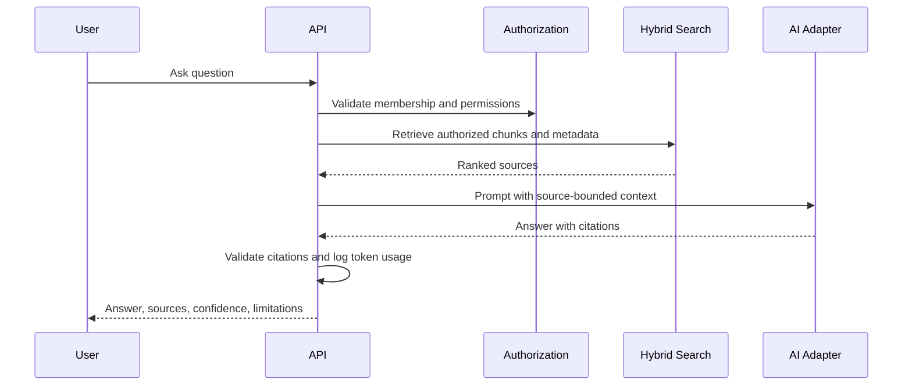

# AI Architecture

## Principles

- The AI must not invent business information.
- Retrieval is scoped to the authenticated user and organization.
- Source authorization happens before context is sent to an AI provider.
- Responses include direct answer, sources, links, confidence or limitations, related entities, and missing-information notes.
- Provider adapters make model vendors replaceable.

## Flow

## Prompt Injection Defenses

- Treat document text as untrusted data.
- Separate system instructions from retrieved content.
- Instruct the model to ignore instructions inside sources.
- Require citations for factual business claims.
- Refuse answers when sources are insufficient.
- Do not expose hidden prompts, secrets, or unauthorized metadata.

## Prompt Versioning

Each assistant workflow stores promptVersion, model, provider, token usage, retrieval filters, and cited source IDs.
